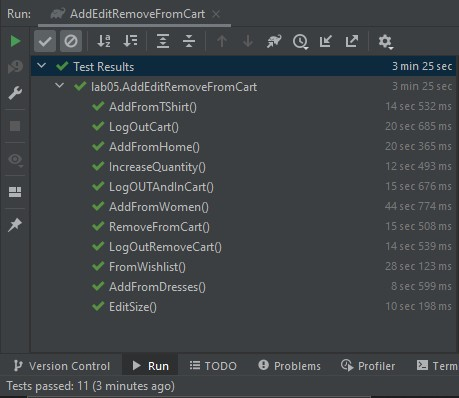
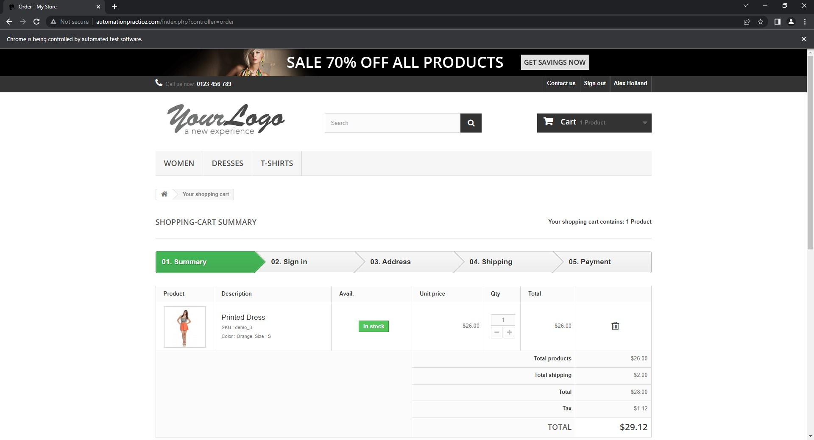
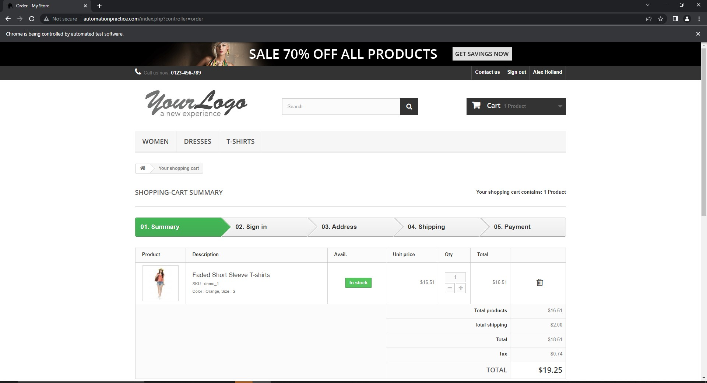
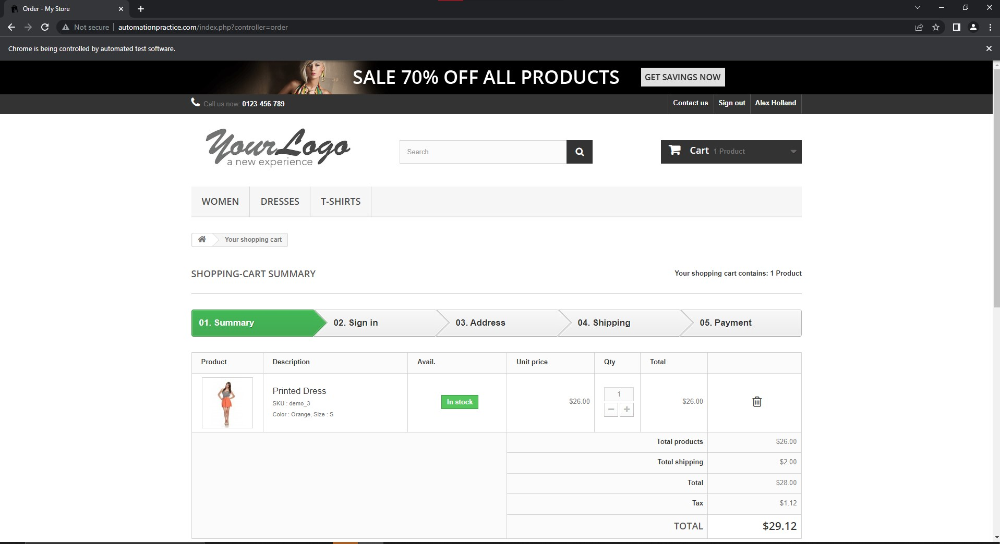
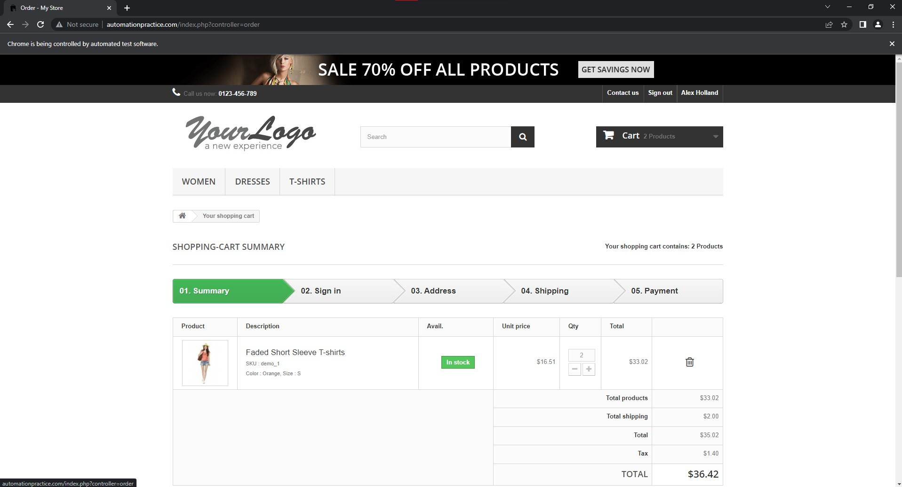
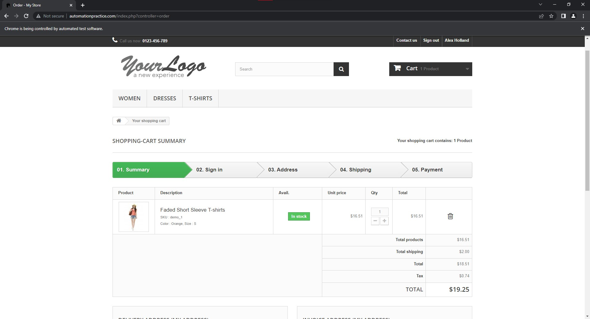
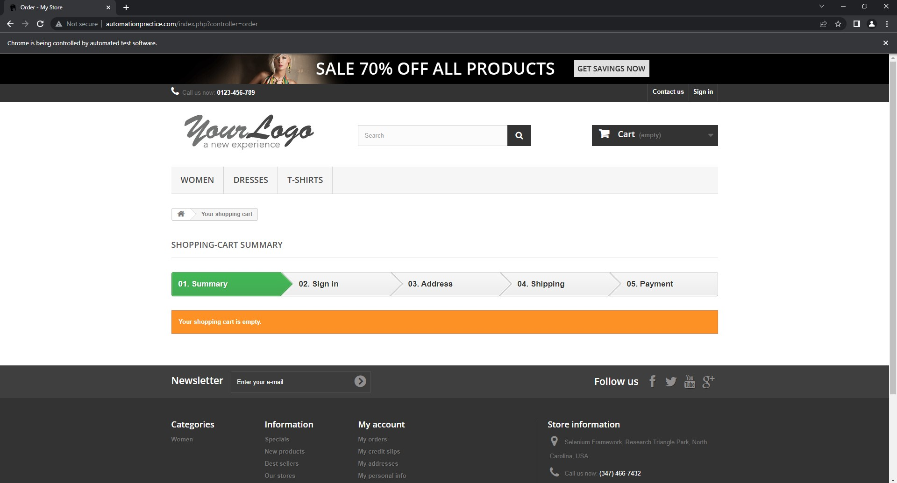

# Assignment 3 - Alex Holland

## Create Account
### Description 
A user is able to create an account with a unique email and their personal information.
### Test Cases
- TC_CA_001: createAccountValid
- TC_CA_002: invalidPassword
- TC_CA_003: wrongPostalCode
- TC_CA_004: emailExists

### CreateAccount.java Selenium automation test script:

```
import org.openqa.selenium.By;
import org.openqa.selenium.WebDriver;
import org.openqa.selenium.WebElement;
import org.openqa.selenium.support.ui.Select;
import org.openqa.selenium.chrome.ChromeDriver;
import org.openqa.selenium.support.ui.WebDriverWait;
import org.openqa.selenium.support.ui.ExpectedConditions;

import org.junit.jupiter.api.Test;
import org.junit.jupiter.api.AfterEach;
import org.junit.jupiter.api.BeforeEach;

import static org.junit.jupiter.api.Assertions.assertTrue;

import java.util.UUID;
import java.util.Random;


public class CreateAccount {
    WebDriver browser;

    // creates a randomly generated email in the form <random string><random integer>@uvic.ca
    public static String generateEmail() {
        Random randomGenerator = new Random();
        int randomInt = randomGenerator.nextInt(1000);
        return String.format("%s%s@%s", UUID.randomUUID().toString().substring(0,3), randomInt, "uvic.ca");
    }

    @BeforeEach
    public void setUp() {
        System.setProperty("webdriver.chrome.driver", "C:\\Users\\Alex\\chromedriver_win32\\chromedriver.exe");
        browser = new ChromeDriver();
        browser.manage().window().maximize();
        browser.get("http://automationpractice.com/index.php?controller=authentication&back=my-account");
    }

    @AfterEach
    public void cleanUp() {
       // browser.quit();
    }

    // TC_CA_001
    @Test
    public void createAccountValid() {
        WebElement emailAddressInput = browser.findElement(By.id("email_create"));
        emailAddressInput.sendKeys(generateEmail());
        WebElement createAccountButton = browser.findElement(By.id("SubmitCreate"));
        createAccountButton.click();
        new WebDriverWait(browser, 5)
                .until(ExpectedConditions.presenceOfElementLocated(By.id("customer_firstname")));

        WebElement firstNameInput = browser.findElement(By.id("customer_firstname"));
        firstNameInput.sendKeys("Alex");
        WebElement lastNameInput = browser.findElement(By.id("customer_lastname"));
        lastNameInput.sendKeys("Holland");
        WebElement passwordInput = browser.findElement(By.id("passwd"));
        passwordInput.sendKeys("password123");
        WebElement addressInput = browser.findElement(By.id("address1"));
        addressInput.sendKeys("123 test st.");
        WebElement cityInput = browser.findElement(By.id("city"));
        cityInput.sendKeys("Victoria");
        Select stateDropdown = new Select(browser.findElement(By.id("id_state")));
        stateDropdown.selectByIndex(1);
        WebElement postcodeInput = browser.findElement(By.id("postcode"));
        postcodeInput.sendKeys("12345");
        WebElement mobilePhoneInput = browser.findElement(By.id("phone_mobile"));
        mobilePhoneInput.sendKeys("123-456-7899");
        WebElement registerButton = browser.findElement(By.id("submitAccount"));
        registerButton.click();
    }

    // TC_CA_002
    @Test
    public void invalidPassword(){
        WebElement emailAddressInput = browser.findElement(By.id("email_create"));
        emailAddressInput.sendKeys(generateEmail());
        WebElement createAccountButton = browser.findElement(By.id("SubmitCreate"));
        createAccountButton.click();
        new WebDriverWait(browser, 5)
                .until(ExpectedConditions.presenceOfElementLocated(By.id("customer_firstname")));

        WebElement firstNameInput = browser.findElement(By.id("customer_firstname"));
        firstNameInput.sendKeys("Alex");
        WebElement lastNameInput = browser.findElement(By.id("customer_lastname"));
        lastNameInput.sendKeys("Holland");
        // input an invalid password
        WebElement passwordInput = browser.findElement(By.id("passwd"));
        passwordInput.sendKeys("test");
        WebElement addressInput = browser.findElement(By.id("address1"));
        addressInput.sendKeys("123 test st.");
        WebElement cityInput = browser.findElement(By.id("city"));
        cityInput.sendKeys("Victoria");
        Select stateDropdown = new Select(browser.findElement(By.id("id_state")));
        stateDropdown.selectByIndex(1);
        WebElement postcodeInput = browser.findElement(By.id("postcode"));
        postcodeInput.sendKeys("12345");
        WebElement mobilePhoneInput = browser.findElement(By.id("phone_mobile"));
        mobilePhoneInput.sendKeys("123-456-7899");
        WebElement registerButton = browser.findElement(By.id("submitAccount"));
        registerButton.click();

        new WebDriverWait(browser, 5)
                .until(ExpectedConditions.presenceOfElementLocated(
                        By.xpath("/html/body/div/div[2]/div/div[3]/div/div"))
                );
        assertTrue(browser.findElements(By.xpath("/html/body/div/div[2]/div/div[3]/div/div")).size() > 0);
    }

    // TC_CA_003
    @Test
    public void wrongPostalCode(){
        WebElement emailAddressInput = browser.findElement(By.id("email_create"));
        emailAddressInput.sendKeys(generateEmail());
        WebElement createAccountButton = browser.findElement(By.id("SubmitCreate"));
        createAccountButton.click();
        new WebDriverWait(browser, 5)
                .until(ExpectedConditions.presenceOfElementLocated(By.id("customer_firstname")));

        WebElement firstNameInput = browser.findElement(By.id("customer_firstname"));
        firstNameInput.sendKeys("Alex");
        WebElement lastNameInput = browser.findElement(By.id("customer_lastname"));
        lastNameInput.sendKeys("Holland");
        WebElement passwordInput = browser.findElement(By.id("passwd"));
        passwordInput.sendKeys("password123");
        WebElement addressInput = browser.findElement(By.id("address1"));
        addressInput.sendKeys("123 test st.");
        WebElement cityInput = browser.findElement(By.id("city"));
        cityInput.sendKeys("Victoria");
        Select stateDropdown = new Select(browser.findElement(By.id("id_state")));
        stateDropdown.selectByIndex(1);
        // input an invalid postal code
        WebElement postcodeInput = browser.findElement(By.id("postcode"));
        postcodeInput.sendKeys("123456");
        WebElement mobilePhoneInput = browser.findElement(By.id("phone_mobile"));
        mobilePhoneInput.sendKeys("123-456-7899");
        WebElement registerButton = browser.findElement(By.id("submitAccount"));
        registerButton.click();

        new WebDriverWait(browser, 5)
                .until(ExpectedConditions.presenceOfElementLocated(
                        By.xpath("/html/body/div/div[2]/div/div[3]/div/div")));
        assertTrue(browser.findElements(
                By.xpath("/html/body/div/div[2]/div/div[3]/div/div")).size() > 0);
    }

    // TC_CA_004
    @Test
    public void emailExists(){
        // d1f403@uvic.ca is an existing email
        WebElement emailAddressInput1 = browser.findElement(By.id("email_create"));
        emailAddressInput1.sendKeys("d1f403@uvic.ca");

        WebElement createAccountButton = browser.findElement(By.id("SubmitCreate"));
        createAccountButton.click();

        new WebDriverWait(browser, 5)
                .until(ExpectedConditions.presenceOfElementLocated(
                        By.xpath("/html/body/div/div[2]/div/div[3]/div/div/div[1]/form/div/div[1]"))
                );
        assertTrue(browser.findElements(
                By.xpath("/html/body/div/div[2]/div/div[3]/div/div/div[1]/form/div/div[1]")).size() > 0);
    }

}
```

Execution screenshot for pass/fail tests of Create Account:


Execution screenshot of the web application interfaces:

<p align="center">
    TC_CA_001
</p>
                


<p align="center">
    TC_CA_002
</p>
                


<p align="center">
    TC_CA_003
</p>
                


<p align="center">
    TC_CA_004
</p>
                


## Login/Logout Functionality 
### Description 
A user is able to login into their prexisting account and be able to logout of it.
### Test Cases
- TC_LF_001: ValidCredentials
- TC_LF_002: InvalidCredentials
- TC_LF_003: ValidEmailInvalidPassword
- TC_LF_004: InvalidemailValidPassword
- TC_LF_005: NoCredentials
- TC_LF_006: MultipleUnsuccessfulAttempts
- TC_LF_007: BrowsingBack
- TC_LF_008: N/A 
- TC_LF_009: SignOutCheck
- TC_LF_010: passwordHidden
- TC_LF_011: resetLinkExists
- TC_LF_012: signOutWorks
- TC_LF_013: signOutGoBack

### LoginFunctionality.java Selenium automation test script:

```
import org.openqa.selenium.By;
import org.openqa.selenium.WebDriver;
import org.openqa.selenium.WebElement;
import org.openqa.selenium.chrome.ChromeDriver;

import org.junit.jupiter.api.Test;
import org.junit.jupiter.api.AfterEach;
import org.junit.jupiter.api.BeforeEach;

import static org.junit.jupiter.api.Assertions.*;

public class LoginFunctionality {
    WebDriver browser;

    @BeforeEach
    public void setUp() {
        System.setProperty("webdriver.chrome.driver", "C:\\Users\\Alex\\chromedriver_win32\\chromedriver.exe");
        browser = new ChromeDriver();
        browser.manage().window().maximize();
        browser.get("http://automationpractice.com/index.php?controller=authentication");
    }

    @AfterEach
    public void cleanUp() {
       browser.quit();
    }

    // TC_LF_001
    @Test
    public void ValidCredentials(){
        WebElement emailAddressInput = browser.findElement(By.id("email"));
        emailAddressInput.sendKeys("d1f403@uvic.ca");
        WebElement passwordInput = browser.findElement(By.id("passwd"));
        passwordInput.sendKeys("password123");
        WebElement signInButton = browser.findElement(By.id("SubmitLogin"));
        signInButton.click();

        assertEquals("My account - My Store", browser.getTitle());
    }

    // TC_LF_002
    @Test
    public void InvalidCredentials(){
        WebElement emailAddressInput = browser.findElement(By.id("email"));
        emailAddressInput.sendKeys("invalidd1f403@uvic.ca");
        WebElement passwordInput = browser.findElement(By.id("passwd"));
        passwordInput.sendKeys("password123");
        WebElement signInButton = browser.findElement(By.id("SubmitLogin"));
        signInButton.click();

        assertTrue(browser.getPageSource().contains("There is 1 error"));
    }

    // TC_LF_003
    @Test
    public void ValidEmailInvalidPassword(){
        WebElement emailAddressInput = browser.findElement(By.id("email"));
        emailAddressInput.sendKeys("d1f403@uvic.ca");
        WebElement passwordInput = browser.findElement(By.id("passwd"));
        passwordInput.sendKeys("$");
        WebElement signInButton = browser.findElement(By.id("SubmitLogin"));
        signInButton.click();

        assertTrue(browser.getPageSource().contains("There is 1 error"));
    }

    // TC_LF_004
    @Test
    public void InvalidEmailValidPassword(){
        WebElement emailAddressInput = browser.findElement(By.id("email"));
        emailAddressInput.sendKeys("d1f403uvic.ca");
        WebElement passwordInput = browser.findElement(By.id("passwd"));
        passwordInput.sendKeys("password123");
        WebElement signInButton = browser.findElement(By.id("SubmitLogin"));
        signInButton.click();

        assertTrue(browser.getPageSource().contains("There is 1 error"));
    }

    // TC_LF_005
    @Test
    public void NoCredentials(){
        WebElement signInButton = browser.findElement(By.id("SubmitLogin"));
        signInButton.click();

        assertTrue(browser.getPageSource().contains("There is 1 error"));
    }

    // TC_LF_006
    @Test
    public void MultipleUnsuccessfulAttempts(){
        for (int i = 0; i < 10; i++) {
            if (i != 0) {
                browser.get("http://automationpractice.com/index.php?controller=authentication");
            }
            WebElement emailAddressInput = browser.findElement(By.id("email"));
            emailAddressInput.sendKeys("d1f403@uvic.ca");
            WebElement passwordInput = browser.findElement(By.id("passwd"));
            passwordInput.sendKeys("invalidpassword123");
            WebElement signInButton = browser.findElement(By.id("SubmitLogin"));
            signInButton.click();
        }
        assertTrue(browser.getPageSource().contains("There is 1 error"));
    }

    // TC_LF_007
    @Test
    public void BrowsingBack(){
        WebElement emailAddressInput = browser.findElement(By.id("email"));
        emailAddressInput.sendKeys("d1f403@uvic.ca");
        WebElement passwordInput = browser.findElement(By.id("passwd"));
        passwordInput.sendKeys("password123");
        WebElement signInButton = browser.findElement(By.id("SubmitLogin"));
        signInButton.click();

        boolean loginContains = browser.getPageSource().contains("Alex Holland");
        WebElement homeButton = browser.findElement(
                By.xpath("/html/body/div/div[2]/div/div[3]/div/ul/li/a/span")
        );
        homeButton.click();
        boolean homeContains = browser.getPageSource().contains("Alex Holland");

        assertEquals(loginContains, homeContains);
    }

    // TC_LF_009
    @Test
    public void signOutCheck(){
        WebElement emailAddressInput = browser.findElement(By.id("email"));
        emailAddressInput.sendKeys("d1f403@uvic.ca");
        WebElement passwordInput = browser.findElement(By.id("passwd"));
        passwordInput.sendKeys("password123");
        WebElement signInButton = browser.findElement(By.id("SubmitLogin"));
        signInButton.click();
        boolean login = browser.getPageSource().contains("Alex Holland");
        WebElement signOutButton = browser.findElement(
                By.xpath("/html/body/div/div[1]/header/div[2]/div/div/nav/div[2]/a")
        );
        signOutButton.click();
        boolean logout = browser.getPageSource().contains("Alex Holland");
        // reopen browser
        browser.navigate().refresh();

        assertFalse(logout); assertTrue(login);
    }

    // TC_LF_010
    @Test
    public void passwordHidden(){
        WebElement emailAddressInput = browser.findElement(By.id("email"));
        emailAddressInput.sendKeys("d1f403@uvic.ca");
        WebElement passwordInput = browser.findElement(By.id("passwd"));
        passwordInput.sendKeys("password123");

        assertTrue(browser.findElements(By.id("passwd")).size() > 0);
    }

    // TC_LF_011
    @Test
    public void resetLinkExists(){
        browser.findElement(By.partialLinkText("Forgot your password")).click();
        assertEquals("Forgot your password - My Store", browser.getTitle());
    }

    // TC_LF_012
    @Test
    public void signOutWorks(){
        WebElement emailAddressInput = browser.findElement(By.id("email"));
        emailAddressInput.sendKeys("d1f403@uvic.ca");
        WebElement passwordInput = browser.findElement(By.id("passwd"));
        passwordInput.sendKeys("password123");
        WebElement signInButton = browser.findElement(By.id("SubmitLogin"));
        signInButton.click();
        assertTrue(browser.getPageSource().contains("Alex Holland"));
        WebElement signOutButton = browser.findElement(
                By.xpath("/html/body/div/div[1]/header/div[2]/div/div/nav/div[2]/a")
        );
        signOutButton.click();
        assertFalse(browser.getPageSource().contains("Alex Holland"));
    }

    // TC_LF_013
    @Test
    public void signOutGoBack(){
        WebElement emailAddressInput = browser.findElement(By.id("email"));
        emailAddressInput.sendKeys("d1f403@uvic.ca");
        WebElement passwordInput = browser.findElement(By.id("passwd"));
        passwordInput.sendKeys("password123");
        WebElement signInButton = browser.findElement(By.id("SubmitLogin"));
        signInButton.click();
        WebElement signOutButton = browser.findElement(
                By.xpath("/html/body/div/div[1]/header/div[2]/div/div/nav/div[2]/a")
        );
        signOutButton.click();

        assertEquals("Login - My Store", browser.getTitle());
    }

}
```

Execution screenshot for pass/fail tests of Login Functionality:


Execution screenshot of the web application interfaces:

<p align="center">
    TC_LF_001
</p>


<p align="center">
    TC_LF_002
</p>


<p align="center">
    TC_LF_003
</p>


<p align="center">
    TC_LF_004
</p>


<p align="center">
    TC_LF_005
</p>


<p align="center">
    TC_LF_006
</p>


<p align="center">
    TC_LF_007
</p>


<p align="center">
    TC_LF_009
</p>


<p align="center">
    TC_LF_010
</p>


<p align="center">
    TC_LF_011
</p>


<p align="center">
    TC_LF_012
</p>


<p align="center">
    TC_LF_013
</p>


## Add-Edit-Remove from Cart
### Description 
A user is able to add, edit, or remove items from their cart.
### Test Cases
- TC_ARC_001: N/A
- TC_ARC_002: AddFromHome
- TC_ARC_003: AddFromWomen
- TC_ARC_004: AddFromDresses
- TC_ARC_005: AddFromTShirt
- TC_ARC_006: FromWishlist
- TC_ARC_007: RemoveFromCart
- TC_ARC_008: IncreaseQuantity 
- TC_ARC_009: EditSize
- TC_ARC_010: LogOUTAndInCart
- TC_ARC_011: LogOutCart
- TC_ARC_012: LogOutRemoveCart

### AddEditRemoveFromCart.java Selenium automation test script:

```
import org.openqa.selenium.By;
import org.openqa.selenium.WebDriver;
import org.openqa.selenium.WebElement;
import org.openqa.selenium.chrome.ChromeDriver;
import org.openqa.selenium.interactions.Actions;
import org.openqa.selenium.support.ui.WebDriverWait;
import org.openqa.selenium.support.ui.ExpectedConditions;

import org.junit.jupiter.api.Test;
import org.junit.jupiter.api.AfterEach;
import org.junit.jupiter.api.BeforeEach;

import static org.junit.jupiter.api.Assertions.assertEquals;
import static org.junit.jupiter.api.Assertions.assertTrue;

public class AddEditRemoveFromCart {
    WebDriver browser;

    @BeforeEach
    public void setUp() {
        System.setProperty("webdriver.chrome.driver", "C:\\Users\\Alex\\chromedriver_win32\\chromedriver.exe");
        browser = new ChromeDriver();
        browser.manage().window().maximize();

        browser.get("http://automationpractice.com/index.php?controller=authentication");

        WebElement email = browser.findElement(By.id("email"));
        email.sendKeys("d1f403@uvic.ca");

        WebElement passwordInput = browser.findElement(By.id("passwd"));
        passwordInput.sendKeys("password123");

        WebElement signInButton = browser.findElement(By.id("SubmitLogin"));
        signInButton.click();
    }

    @AfterEach
    public void cleanUp() {
        browser.quit();
    }

    // TC_ARC_002
    @Test
    public void AddFromHome(){
        WebElement start = browser.findElement(By.xpath("/html/body/div/div[2]/div/div[3]/div/ul/li/a/span"));
        start.click();

        Actions action = new Actions(browser);
        action.moveToElement(browser.findElement(
                By.xpath("/html/body/div/div[2]/div/div[2]/div/div[1]/ul[1]/li[3]/div/div[1]/div/a[1]/img"))).perform();

        WebElement addToCartButton = browser.findElement(
                By.xpath("/html/body/div/div[2]/div/div[2]/div/div[1]/ul[1]/li[3]/div/div[2]/div[2]/a[1]/span"));
        addToCartButton.click();

        WebElement proceedToCheckoutButton = browser.findElement(
                By.xpath("/html/body/div/div[1]/header/div[3]/div/div/div[4]/div[1]/div[2]/div[4]/a/span"));
        new WebDriverWait(browser, 5)
                .until(ExpectedConditions.visibilityOfElementLocated(
                        By.xpath("/html/body/div/div[1]/header/div[3]/div/div/div[4]/div[1]/div[2]/div[4]/a/span")));
        proceedToCheckoutButton.click();

        assertEquals("Order - My Store", browser.getTitle());
    }

    // TC_ARC_003
    @Test
    public void AddFromWomen(){
        WebElement category = browser.findElement(By.partialLinkText("Women"));
        category.click();

        Actions action = new Actions(browser);
        action.moveToElement(browser.findElement(
                By.xpath("/html/body/div/div[2]/div/div[3]/div[2]/ul/li[1]/div/div[1]/div/a[1]/img"))).perform();

        WebElement cart = browser.findElement(
                By.xpath("/html/body/div/div[2]/div/div[3]/div[2]/ul/li[1]/div/div[2]/div[2]/a[1]/span"));
        cart.click();

        WebElement gotoCheckout = browser.findElement(
                By.xpath("/html/body/div/div[1]/header/div[3]/div/div/div[4]/div[1]/div[2]/div[4]/a/span"));
        new WebDriverWait(browser, 5)
                .until(ExpectedConditions.visibilityOfElementLocated(
                        By.xpath("/html/body/div/div[1]/header/div[3]/div/div/div[4]/div[1]/div[2]/div[4]/a/span")));
        gotoCheckout.click();

        assertEquals("Order - My Store", browser.getTitle());
    }

    // TC_ARC_004
    @Test
    public void AddFromDresses(){
        WebElement dress = browser.findElement(
                By.xpath("/html/body/div/div[1]/header/div[3]/div/div/div[6]/ul/li[2]/a"));
        dress.click();

        Actions action = new Actions(browser);
        action.moveToElement(browser.findElement(
                By.xpath("/html/body/div/div[2]/div/div[3]/div[2]/ul/li[1]/div/div[1]/div/a[1]/img"))).perform();

        WebElement cart = browser.findElement(
                By.xpath("/html/body/div/div[2]/div/div[3]/div[2]/ul/li[1]/div/div[2]/div[2]/a[1]/span"));
        cart.click();

        WebElement gotoCheckout = browser.findElement(
                By.xpath("/html/body/div/div[1]/header/div[3]/div/div/div[4]/div[1]/div[2]/div[4]/a/span"));
        new WebDriverWait(browser, 5)
                .until(ExpectedConditions.visibilityOfElementLocated(
                        By.xpath("/html/body/div/div[1]/header/div[3]/div/div/div[4]/div[1]/div[2]/div[4]/a/span")));
        gotoCheckout.click();

        assertEquals("Order - My Store", browser.getTitle());
    }


    // TC_ARC_005
    @Test
    public void AddFromTShirt(){
        WebElement tShirt = browser.findElement(
                By.xpath("/html/body/div/div[1]/header/div[3]/div/div/div[6]/ul/li[3]/a"));
        tShirt.click();

        Actions action = new Actions(browser);
        action.moveToElement(browser.findElement(
                By.xpath("/html/body/div/div[2]/div/div[3]/div[2]/ul/li/div/div[1]/div/a[1]/img"))).perform();

        WebElement addToCart = browser.findElement(
                By.xpath("/html/body/div/div[2]/div/div[3]/div[2]/ul/li/div/div[2]/div[2]/a[1]/span"));
        addToCart.click();

        WebElement gotoCheckout = browser.findElement(
                By.xpath("/html/body/div/div[1]/header/div[3]/div/div/div[4]/div[1]/div[2]/div[4]/a/span"));
        new WebDriverWait(browser, 5)
                .until(ExpectedConditions.visibilityOfElementLocated(
                        By.xpath("/html/body/div/div[1]/header/div[3]/div/div/div[4]/div[1]/div[2]/div[4]/a/span")));
        gotoCheckout.click();

        assertEquals("Order - My Store", browser.getTitle());
    }

    // TC_ARC_006
    @Test
    public void FromWishlist(){
        WebElement category = browser.findElement(By.partialLinkText("Women"));
        category.click();

        Actions action = new Actions(browser);
        action.moveToElement(browser.findElement(
                By.xpath("/html/body/div/div[2]/div/div[3]/div[2]/ul/li[3]/div/div[1]/div/a[1]/img"))).perform();

        WebElement more = browser.findElement(
                By.xpath("/html/body/div/div[2]/div/div[3]/div[2]/ul/li[3]/div/div[2]/div[2]/a[2]/span"));
        more.click();

        WebElement addToWishList = browser.findElement(
                By.xpath("/html/body/div/div[2]/div/div[3]/div/div/div/div[4]/form/div/div[3]/p/a"));
        addToWishList.click();

        browser.navigate().back();
        browser.navigate().back();

        WebElement wishList = browser.findElement(
                By.xpath("/html/body/div/div[2]/div/div[3]/div/div/div[2]/ul/li/a/span"));
        wishList.click();

        WebElement viewWishList = browser.findElement(
                By.xpath("/html/body/div/div[2]/div/div[3]/div[2]/div/div[1]/table/tbody/tr/td[1]/a"));
        viewWishList.click();

        browser.get("https://tinyurl.com/mr246cz6");
        WebElement view = browser.findElement(
                By.xpath("/html/body/div/div[2]/div/div[3]/div[2]/div/div/ul/li/div/div[2]/div/div/div/a/span"));
        view.click();

        WebElement addToCart = browser.findElement(
                By.xpath("/html/body/div/div[2]/div/div[3]/div/div/div/div[4]/form/div/div[3]/div[1]/p/button/span"));
        addToCart.click();

        WebElement proceedToCheckoutButton = browser.findElement(
                By.xpath("/html/body/div/div[1]/header/div[3]/div/div/div[4]/div[1]/div[2]/div[4]/a/span"));
        new WebDriverWait(browser, 5)
                .until(ExpectedConditions.visibilityOfElementLocated(
                        By.xpath("/html/body/div/div[1]/header/div[3]/div/div/div[4]/div[1]/div[2]/div[4]/a/span")));
        proceedToCheckoutButton.click();

        assertEquals("Order - My Store", browser.getTitle());
    }


    // TC_ARC_007
    @Test
    public void RemoveFromCart(){
        WebElement category = browser.findElement(By.partialLinkText("Women"));
        category.click();

        Actions action = new Actions(browser);
        action.moveToElement(browser.findElement(
                By.xpath("/html/body/div/div[2]/div/div[3]/div[2]/ul/li[1]/div/div[1]/div/a[1]/img"))).perform();

        WebElement addToCart = browser.findElement(
                By.xpath("/html/body/div/div[2]/div/div[3]/div[2]/ul/li[1]/div/div[2]/div[2]/a[1]/span"));
        addToCart.click();

        WebElement gotoCheckout = browser.findElement(
                By.xpath("/html/body/div/div[1]/header/div[3]/div/div/div[4]/div[1]/div[2]/div[4]/a/span"));
        new WebDriverWait(browser, 5)
                .until(ExpectedConditions.visibilityOfElementLocated(
                        By.xpath("/html/body/div/div[1]/header/div[3]/div/div/div[4]/div[1]/div[2]/div[4]/a/span")));
        gotoCheckout.click();

        WebElement deleteItem = browser.findElement(
                By.xpath("/html/body/div/div[2]/div/div[3]/div/div[2]/table/tbody/tr/td[7]/div/a/i"));
        deleteItem.click();

        assertTrue(browser.getPageSource().contains("Your shopping cart is empty."));
    }

    // TC_ARC_008
    @Test
    public void IncreaseQuantity(){
        WebElement category = browser.findElement(By.partialLinkText("Women"));
        category.click();

        Actions action = new Actions(browser);
        action.moveToElement(browser.findElement(
                By.xpath("/html/body/div/div[2]/div/div[3]/div[2]/ul/li[1]/div/div[1]/div/a[1]/img"))).perform();

        WebElement more = browser.findElement(
                By.xpath("/html/body/div/div[2]/div/div[3]/div[2]/ul/li[1]/div/div[2]/div[2]/a[2]/span"));
        more.click();

        WebElement increaseQuantity = browser.findElement(
                By.xpath("/html/body/div/div[2]/div/div[3]/div/div/div/div[4]/form/div/div[2]/p[1]/a[2]/span/i"));
        increaseQuantity.click();

        WebElement addToCart = browser.findElement(
                By.xpath("/html/body/div/div[2]/div/div[3]/div/div/div/div[4]/form/div/div[3]/div[1]/p/button/span"));
        addToCart.click();

        WebElement gotoCheckout = browser.findElement(
                By.xpath("/html/body/div/div[1]/header/div[3]/div/div/div[4]/div[1]/div[2]/div[4]/a/span"));
        new WebDriverWait(browser, 5)
                .until(ExpectedConditions.visibilityOfElementLocated(
                        By.xpath("/html/body/div/div[1]/header/div[3]/div/div/div[4]/div[1]/div[2]/div[4]/a/span")));
        gotoCheckout.click();

        assertTrue(browser.getPageSource().contains("2 Products"));
    }

    //TC_ARC_009
    @Test
    public void EditSize(){
        WebElement category = browser.findElement(By.partialLinkText("Women"));
        category.click();

        Actions action = new Actions(browser);
        action.moveToElement(browser.findElement(
                By.xpath("/html/body/div/div[2]/div/div[3]/div[2]/ul/li[1]/div/div[1]/div/a[1]/img"))).perform();

        WebElement more = browser.findElement(
                By.xpath("/html/body/div/div[2]/div/div[3]/div[2]/ul/li[1]/div/div[2]/div[2]/a[2]/span"));
        more.click();

        WebElement editSizeDropdown = browser.findElement(
                By.xpath("/html/body/div/div[2]/div/div[3]/div/div/div/div[4]/" +
                        "form/div/div[2]/div/fieldset[1]/div/div/select/option[3]"));
        editSizeDropdown.click();

        WebElement addToCart = browser.findElement(
                By.xpath("/html/body/div/div[2]/div/div[3]/div/div/div/div[4]/form/div/div[3]/div[1]/p/button/span"));
        addToCart.click();

        WebElement gotoCheckout = browser.findElement(
                By.xpath("/html/body/div/div[1]/header/div[3]/div/div/div[4]/div[1]/div[2]/div[4]/a/span"));
        new WebDriverWait(browser, 5)
                .until(ExpectedConditions.visibilityOfElementLocated(
                        By.xpath("/html/body/div/div[1]/header/div[3]/div/div/div[4]/div[1]/div[2]/div[4]/a/span")));
        gotoCheckout.click();

        assertTrue(browser.getPageSource().contains("Color : Orange, Size : L"));
    }

    // TC_ARC_010
    @Test
    public void LogOUTAndInCart(){
        String emailInput = "d1f403@uvic.ca";
        String passwordInput = "password123";
        WebElement category = browser.findElement(By.partialLinkText("Women"));
        category.click();

        Actions action = new Actions(browser);
        action.moveToElement(browser.findElement(
                By.xpath("/html/body/div/div[2]/div/div[3]/div[2]/ul/li[1]/div/div[1]/div/a[1]/img"))).perform();

        WebElement more = browser.findElement(
                By.xpath("/html/body/div/div[2]/div/div[3]/div[2]/ul/li[1]/div/div[2]/div[2]/a[2]/span"));
        more.click();

        WebElement addToCart = browser.findElement(
                By.xpath("/html/body/div/div[2]/div/div[3]/div/div/div/div[4]/form/div/div[3]/div[1]/p/button/span"));
        addToCart.click();

        WebElement gotoCheckout = browser.findElement(
                By.xpath("/html/body/div/div[1]/header/div[3]/div/div/div[4]/div[1]/div[2]/div[4]/a/span"));
        new WebDriverWait(browser, 5)
                .until(ExpectedConditions.visibilityOfElementLocated(
                        By.xpath("/html/body/div/div[1]/header/div[3]/div/div/div[4]/div[1]/div[2]/div[4]/a/span")));
        gotoCheckout.click();

        WebElement signOut = browser.findElement(By.partialLinkText("Sign out"));
        signOut.click();

        WebElement signIn = browser.findElement(By.partialLinkText("Sign in"));
        signIn.click();

        WebElement email = browser.findElement(By.id("email"));
        email.sendKeys(emailInput);

        WebElement password = browser.findElement(By.id("passwd"));
        password.sendKeys(passwordInput);

        WebElement signIn2 = browser.findElement(By.id("SubmitLogin"));
        signIn2.click();

        WebElement cart = browser.findElement(By.xpath("/html/body/div/div[1]/header/div[3]/div/div/div[3]/div/a"));
        cart.click();

        assertTrue(browser.getPageSource().contains("1 Product"));
    }

    // TC_ARC_011
    @Test
    public void LogOutCart(){
        WebElement signOut = browser.findElement(By.partialLinkText("Sign out"));
        signOut.click();

        WebElement category = browser.findElement(By.partialLinkText("Women"));
        category.click();

        Actions action = new Actions(browser);
        action.moveToElement(browser.findElement(
                By.xpath("/html/body/div/div[2]/div/div[3]/div[2]/ul/li[1]/div/div[1]/div/a[1]/img"))).perform();

        WebElement more = browser.findElement(
                By.xpath("/html/body/div/div[2]/div/div[3]/div[2]/ul/li[1]/div/div[2]/div[2]/a[2]/span"));
        more.click();

        WebElement addToCart = browser.findElement(
                By.xpath("/html/body/div/div[2]/div/div[3]/div/div/div/div[4]/form/div/div[3]/div[1]/p/button/span"));
        addToCart.click();

        WebElement gotoCheckout = browser.findElement(
                By.xpath("/html/body/div/div[1]/header/div[3]/div/div/div[4]/div[1]/div[2]/div[4]/a/span"));
        new WebDriverWait(browser, 5)
                .until(ExpectedConditions.visibilityOfElementLocated(
                        By.xpath("/html/body/div/div[1]/header/div[3]/div/div/div[4]/div[1]/div[2]/div[4]/a/span")));
        gotoCheckout.click();

        assertTrue(browser.getPageSource().contains("1 Product"));
    }

    // TC_ARC_012
    @Test
    public void LogOutRemoveCart(){
        WebElement signOut = browser.findElement(By.partialLinkText("Sign out"));
        signOut.click();

        WebElement category = browser.findElement(By.partialLinkText("Women"));
        category.click();

        Actions action = new Actions(browser);
        action.moveToElement(browser.findElement(
                By.xpath("/html/body/div/div[2]/div/div[3]/div[2]/ul/li[1]/div/div[1]/div/a[1]/img"))).perform();

        WebElement more = browser.findElement(
                By.xpath("/html/body/div/div[2]/div/div[3]/div[2]/ul/li[1]/div/div[2]/div[2]/a[2]/span"));
        more.click();

        WebElement addToCart = browser.findElement(
                By.xpath("/html/body/div/div[2]/div/div[3]/div/div/div/div[4]/form/div/div[3]/div[1]/p/button/span"));
        addToCart.click();

        WebElement gotoCheckout = browser.findElement(
                By.xpath("/html/body/div/div[1]/header/div[3]/div/div/div[4]/div[1]/div[2]/div[4]/a/span"));
        new WebDriverWait(browser, 5)
                .until(ExpectedConditions.visibilityOfElementLocated(
                        By.xpath("/html/body/div/div[1]/header/div[3]/div/div/div[4]/div[1]/div[2]/div[4]/a/span")));
        gotoCheckout.click();

        WebElement delete = browser.findElement(
                By.xpath("/html/body/div/div[2]/div/div[3]/div/div[2]/table/tbody/tr/td[7]/div/a/i"));
        delete.click();

        assertTrue(browser.getPageSource().contains("Your shopping cart is empty."));
    }

}
```

Execution screenshot for pass/fail tests of Add Edit Remove From:



Execution screenshot of the web application interfaces:

<p align="center">
    TC_ARC_002
</p>


<p align="center">
    TC_ARC_003
</p>


<p align="center">
    TC_ARC_004
</p>



<p align="center">
    TC_ARC_005
</p>



<p align="center">
    TC_ARC_006
</p>



<p align="center">
    TC_ARC_007
</p>


<p align="center">
    TC_ARC_008
</p>



<p align="center">
    TC_ARC_009
</p>


<p align="center">
    TC_ARC_010
</p>



<p align="center">
    TC_ARC_011
</p>


<p align="center">
    TC_ARC_012
</p>



